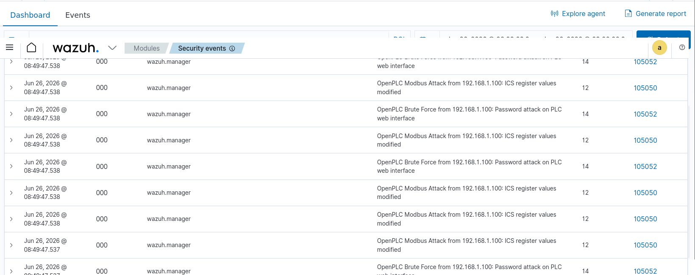
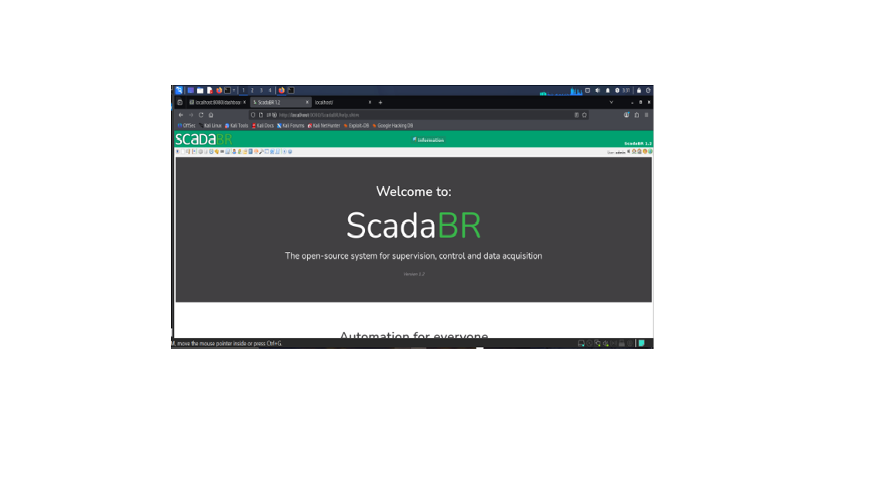
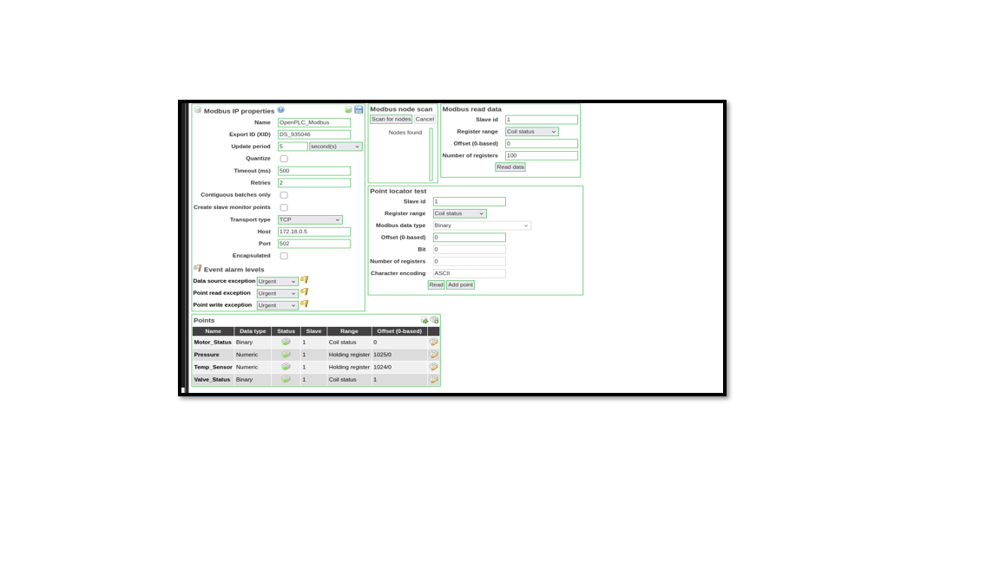
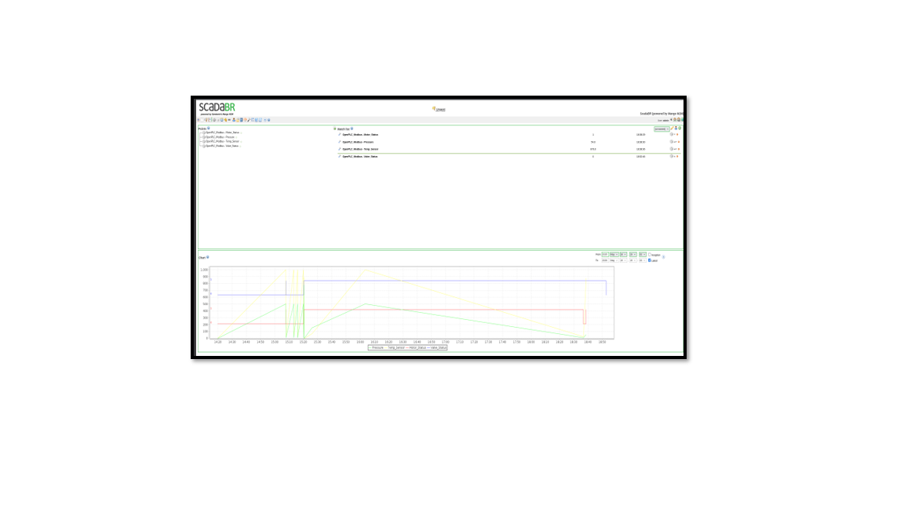
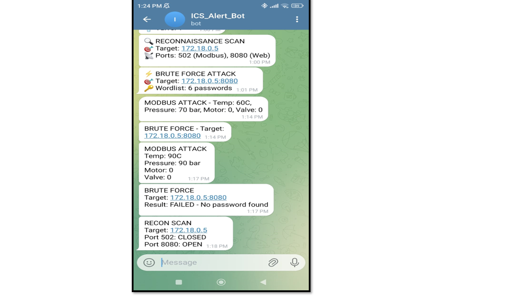
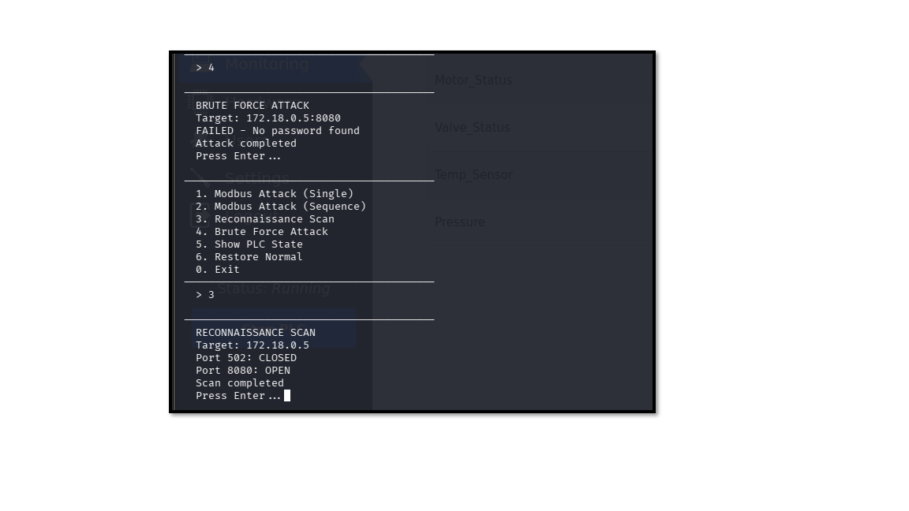

# ICS/SCADA Attack Detection Platform using Wazuh SIEM

## Overview

This project demonstrates a complete Industrial Control System (ICS/SCADA) cybersecurity platform designed to simulate cyberattacks against an industrial PLC and detect them in real time using Wazuh SIEM.

The objective is to monitor industrial environments, detect malicious activities, and generate real-time security alerts.

---

## Architecture

```
                 +----------------------+
                 |      Kali Linux      |
                 |   Attack Machine     |
                 +----------+-----------+
                            |
          Modbus / HTTP / Nmap Attacks
                            |
                            v
+----------------+     Modbus TCP (502)     +----------------+
|    OpenPLC     | <----------------------> |    ScadaBR     |
|  Honeypot PLC  |                          |   HMI / SCADA  |
+--------+-------+                          +-------+--------+
         |
         | Logs
         v
+----------------------+
|     Wazuh SIEM       |
| Detection & Analysis |
+----------+-----------+
           |
           | Alerts
           v
+----------------------+
|    Telegram Bot      |
| Real-time Alerts     |
+----------------------+
```

---

## Simulated Attacks

### Modbus Injection
- Manipulation of PLC registers.
- Modification of Temperature and Pressure values.
- Detection using custom Wazuh rules.

### Brute Force Attack
- Multiple login attempts against the OpenPLC web interface.

### Reconnaissance
- Nmap scan targeting ports:
  - TCP 502 (Modbus)
  - TCP 8080 (OpenPLC)

---

## Detection Results

The platform successfully detects all simulated attacks.

- Wazuh Alert Level 10
- Wazuh Alert Level 12
- Wazuh Alert Level 14

Real-time monitoring through:

- Wazuh Dashboard
- ScadaBR HMI
- Telegram Bot Notifications

Attack logs are stored in:

```text
/var/log/openplc/attacks.log
```

---

## Technologies

- Python
- Docker
- Wazuh SIEM
- OpenPLC
- ScadaBR
- Modbus TCP
- Telegram Bot
- Kali Linux

---

## Repository Structure

```
config/
openplc/
scadabr/
honeypot_modbus.py
docker-compose.yml
README.md
```

---

## Future Improvements

- Snort Integration
- Suricata Integration
- MITRE ATT&CK Mapping
- Machine Learning Detection
- Additional ICS Protocols

---
## Screenshots

### Wazuh Dashboard



---

### Wazuh Alert Details


---

### OpenPLC / ScadaBR



---

### PLC Data Monitoring



---

### Watch List



---

### Telegram Notification



---

### Python Attack Script



---

### Wazuh Agent


**TARIK FARROUGI**
